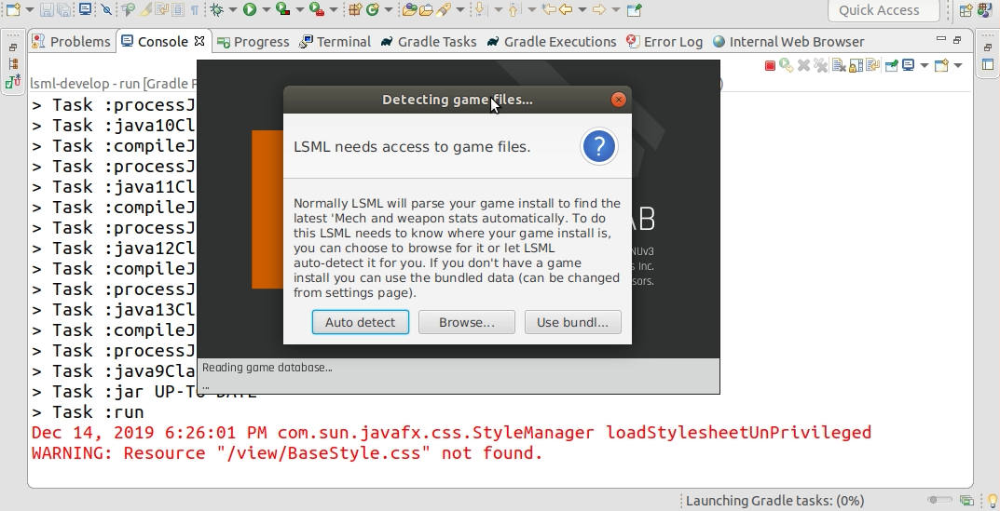

# mrJarLiSong

## The Li Song Mech Lab Project Gets mrJar-olated

This project was copied from @EmilyBjoerk's [*Li Song Mech Lab*](https://github.com/EmilyBjoerk/lsml) in order to demonstrate an answer posted to a [*Stackoverflow JPMS question*](http://bit.ly/mrJarSOA) asked by the original project's author.

It demonstrates how to JPMS-enable Gradle; which lacks built-in JPMS capability. It also demonstrates the [***mrJar***](http://bit.ly/mrJar) plugin's *Eclipse Modulefication* feature.

To observe how the Li Song Mech Lab project has been successfully JPMS-enabled, you could run the *`:test`* task or the *`:run`* task from the command line. Or follow these steps to build, test and run the test project in Eclipse...

1. Import the project into Eclipse 
   * [*this screen recording*](https://imgur.com/qutVDEd) might be of some value

2. Execute the *`:eclipse`* task
   * this is what triggers the *Eclipse Modulefication* feature of ***mrJar***

3. Open the project's properties dialog
   * Go to the *`Java Build Path`* properties tab
   * Notice the notification in the title bar (*`Not all modules could be found. Click Apply to synchronize`*), and click the *`Apply`* button to synchronize the module path

4. Execute the *`:test`* task
   * or alternatively, do *`Run As Gradle Test`*  - six of one, half a dozen of the other
   * or alternatively again, executing the *`:check`* task is another option that has the same *Eclipse Modulefication* effect as the other three options

[*This screen recording*](https://imgur.com/qutVDEd) might help you to see the steps you need to follow to run the unit tests and the JavaFX application in Eclipse. 

